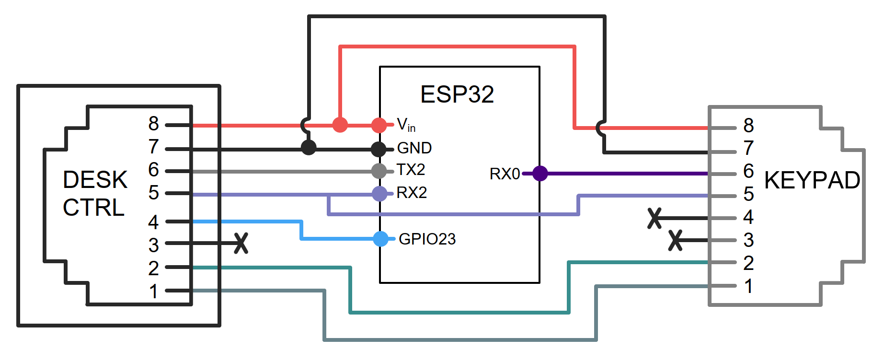
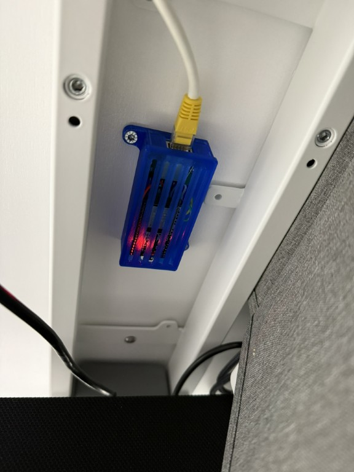
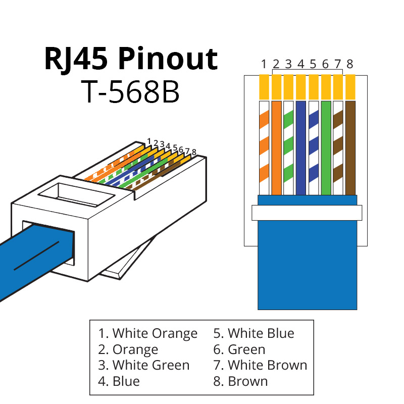

(*image source: [Windows Central](https://www.windowscentral.com/flexispot-e5-standing-desk-review)*)

> [!WARNING]
> Be careful. Tinkering with electronics can be risky. Use this guide at your own risk.

## Turn your LoctekMotion/FlexiSpot desk into a smart desk

When I assembled my FlexiSpot standing desk, I noticed the control panel had an RJ45 cable and a second RJ45 port. This sparked my interest: can I connect my desk to the internet?

Most Flexispot models utilize components from LoctekMotion, a manufacturer specializing in lifting columns for height-adjustable desks. Although LoctekMotion previously advertised a [Bluetooth receiver](https://www.loctekmotion.com/shop/accessories/bt-desk-app/) for their control boxes, I haven't been able to obtain one.

This repository will guide you on connecting your desk to Home Assistant and other systems using the serial communication ports (RJ45). Imagine controlling your desk with your voice or receiving notifications when you've been sitting too long. Or, just do it because it's cool 🤓.

## Features

- Control your desk (up, down, stop) using a cover entity
- Manage 4 presets with button entities
- Monitor desk height with a sensor entity
- Adjust desk height in cm using a number entity *(experimental)*

#### Known issues

- Number entity may overshoot. The desk moves until the height sensor matches the requested height, which may cause overshooting due to reporting delays. Use the desk controller presets for accurate positioning.

## Packages

| Name                                                           | Description                                                                                                                    |
| ------------------------------------------                     | --------------------------------------------------------------------------------------------------------------------           |
| [ESPHome](packages/office-desk-esp32.yaml)                     | Control your desk via an ESP32 module connected to Home Assistant. Can be adapted to ESP8266 or other ESP32 variant.           |
| [ESPHome Pass-through](packages/pass-through-desk-esp32.yaml)  | Control desks which have only one RJ45 port using passthrough configuration via an ESP32 module connected to Home Assistant. |

For v1 packages (Arduino, Raspberry Pi, older ESPHome packages, and different pin-outs), visit the [`archive`](./archive/) directory. For alternative solutions, see [similar projects](#similar-projects).

## Getting started

Please follow the [ESPHome documentation](https://esphome.io/guides/getting_started_command_line.html) for the basics of ESPHome. You can use the provided [`office-desk-esp32.yaml`](https://github.com/iMicknl/LoctekMotion_IoT/blob/main/packages/office-desk-esp32.yaml) as a boilerplate for your own implementation. This implementation has been created for the ESP32 nodemcu, but can easily be adopted for other platforms and boards.

### Pin-out

| RJ45 pin | Name      | ESP32        |
| -------- | --------- | ------------ |
| 8        | +5V (VDD) | VIN          |
| 7        | GND       | GND          |
| 6        | TX        | TX2 (GPIO17) |
| 5        | RX        | RX2 (GPIO16) |
| 4        | PIN 20    | D23 (GPIO23) |
| 3        | (unknown) |              |
| 2        | SWIM      |              |
| 1        | RES       |              |

This pin-out should be compatible with all control panels featuring an RJ45 port for serial communication. If it doesn't work for your setup, consider trying an alternative pin-out from the [archive](./archive/esphome/README.md).

Use the provided pin-out to connect your ESP32 to the desk controller's RJ45 port using an ethernet cable. If you're not experienced with electronics and soldering, consider using an RJ45 Adapter Board from sites like Aliexpress, connected with Dupont cables to your ESP32.

#### Pass-Through Configuations

If your desk controller lacks an extra RJ45 port, you'll need a pass-through solution. This requires connecting the RJ45 of the keypad to the pins below.

| KeyPad RJ45 pin | Name      | Connection
| -------- | --------- | ------------
| 8        | +5V (VDD) |  VIN  (Split)
| 7        | GND       |  GND  (Split)
| 6        | TX        |  RX0  (GPIO3)
| 5        | RX        |  RX2  (Split)
| 4        | PIN 20    |  (Not Required)
| 3        | (unknown) |  (Not Required)
| 2        | SWIM      |  (Pass-Through)
| 1        | RES       |  (Pass-Through)

The pins marked Split are to be connected to the ESP32 pin, the desk controller and to the keypad. The pins marked pass-through are to be connected directly between the controller and the keypad.
Note: the current implentation does not utilise PIN20 however, this could be utilised to sense if the screen is on if desired.

### Optional: Custom Enclosure for a Clean Setup

To keep your setup clean and well-protected, a custom enclosure for the ESP32 DevKit with Ethernet breakout is available. It ensures secure housing, optimal cable management, and a stable wired connection.

Features ✅:
- Secure housing – Protects the ESP32 and Ethernet breakout
- Optimized cable management – Keeps wiring neat and organized
- Ventilation slots – Prevents overheating
- Easy mounting – Designed for a hassle-free installation
- Compact design – Fits seamlessly into any setup

🔗 Download the enclosure model at [makerworld.com](https://makerworld.com/de/models/1220796-flexispot-smartdesk-enclosure-esp32-devkit-lan#profileId-1237633).

### Troubleshooting

**My height sensor is not providing the correct value**
- Uncomment the debug line for UART in the ESPHome configuration to see the raw data coming from the desk controller. This will help you collect information to troubleshoot the issue. See [debugging UART](https://esphome.io/components/uart.html#debugging).
- If your cover entity has up/down buttons grayed out due to height sensor issues, you can change the internal parameter for the up/down switch from `true` to `false`in the YAML configuration.

## Research

If you are interested in the internals of the LoctecMotion desk system, have a look at the research below which is composed of my own findings combined with findings of [similar projects](#similar-projects).

Full research

### Control Panels

At the time of writing, LoctekMotion sells [11 different control panels](https://www.loctekmotion.com/product/control-panel/). The features can differ per model, but it looks like the serial interface is pretty similar for the more advanced models.

The tables below will show a mapping of the RJ45 pinout to the pinout used by the control panel. Please note that all RJ45 pins are described in the following way:

The most common [color convention](https://www.showmecables.com/blog/post/rj45-pinout)
for wiring RJ45 for network cables is:

In order to connect the control box to a Raspberry Pi and ESP32/ESP8266 chip I used a [RJ45 to RS232 adapter](https://www.allekabels.nl/rs232-kabel/4568/1041186/rj45-naar-rs232.html) with DuPont cables (jump wires), but you simply can cut and split an ethernet cable as well.

#### Supported Control Panels
<!-- prettier-ignore-start -->
<!-- markdownlint-disable -->
<table>
  <tr>
    <td align="center"><a href="#hs13b-1"> <b>HS13B-1</b></a></td>
    <td align="center"><a href="#hs13a-1"> <b>HS13A-1</b></a></td>
    <td align="center"><a href="#hs01b-1"> <b>HS01B-1</b></a></td>
  </tr>
</table>
<!-- markdownlint-enable -->
<!-- prettier-ignore-end -->

> [!NOTE]
> Eventually, we discovered that a single pin-out should work for all control panels. It seems multiple mappings can be used, but the most common one is the one used for the HS13B-1 control panel.

#### HS13B-1

- **Desk model**: Flexispot E7
- **Tested with control box**: CB38M2J(IB)-1
- **Source**: Printed on the PCB of the control box.

| RJ45 pin | Name      | Original Cable Color | Ethernet cable color (T568B) |
| -------- | --------- | -------------------- | ---------------------------- |
| 1        | RESET     | Brown                | White-Orange                 |
| 2        | SWIM      | White                | Orange                       |
| 3        | EMPTY     | Purple               | White-Green                  |
| 4        | PIN 20    | Red                  | Blue                         |
| 5        | RX        | Green                | White-Blue                   |
| 6        | TX        | Black                | Green                        |
| 7        | GND       | Blue                 | White-Brown                  |
| 8        | +5V (VDD) | Yellow               | Brown                        |

Note that RX and TX is defined like this on receiver (control panel) side.
So the custom controller also uses RX to receive data and TX to send data.

#### HS13A-1

- **Desk model**: Flexispot EK5
- **Tested with control box**: CB38M2B(IB)-1
- **Source**: Printed on the PCB of the control box.

| RJ45 pin | Name       | Original Cable Color | Ethernet cable color (T568B) |
| -------- | ---------- | -------------------- | ---------------------------- |
| 1        | RESET SWIM | Brown                | White-Orange                 |
| 2        | PIN 20     | White                | Orange                       |
| 3        | RX         | Purple               | White-Green                  |
| 4        | TX         | Red                  | Blue                         |
| 5        | GND1       | Green                | White-Blue                   |
| 6        | +5V (VDD)  | Black                | Green                        |
| 7        | 29V+       | Blue                 | White-Brown                  |
| 8        | 29V-       | Yellow               | Brown                        |

Note that RX and TX is defined like this on receiver (control panel) side.
So the custom controller also uses RX to receive data and TX to send data.

#### HS01B-1

- **Desk model**: Flexispot E5B
- **Tested with control box**: CB38M2A-1
- **Source**: [nv1t/standing-desk-interceptor](https://github.com/nv1t/standing-desk-interceptor)

| RJ45 pin | Name      |
| -------- | --------- |
| 8        | +5V (VDD) |
| 7        | GND       |
| 6        | TX        |
| 5        | RX        |
| 4        | PIN 20    |
| 3        | (unknown) |
| 2        | SWIM      |
| 1        | RES       |

Note that RX and TX is defined like this on receiver (control panel) side.
So the custom controller also uses RX to receive data and TX to send data.

Other control panels / control boxes could be supported in the same way, but you would need to figure the RJ45 pinout mapping. Most control boxes have an extra RJ45 port for serial communication, but otherwise you would need to place your device in between the control panel and the control box.

### Retrieve current height

Based upon the great work of [minifloat](https://www.mikrocontroller.net/topic/493524), it became clear that the control panel utilises a [7-segment display](https://en.wikipedia.org/wiki/Seven-segment_display). Fortunately, this is very common in such devices and thus there is a lot of [documentation](https://lastminuteengineers.com/seven-segment-arduino-tutorial/) on this topic.

The control box sends the height as 4-bit hexadecimal, which is decoded in the control panel to drive the 7-segment display. The second number on the display also supports an optional decimal point ("8 segment").

Make sure you set the baud rate to 9600. For most LoctekMotion desks, the control box only broadcasts the current height for x seconds after you sent the Wake Up command. Otherwise you will receive `0x00` `0x00` `0x00` as payload.

source: [alselectro](https://alselectro.wordpress.com/2015/03/03/8051-tutorials-3-interfacing-7-segment-display/)

### Execute a command

The control box only accepts commands when the 'screen is active'. To activate the screen, `PIN 20` needs to be set to HIGH for about 1 second. The screen gets disabled automatically again after some amount of time receiving no commands.

#### Command list

| Command name     | Start | Length | Type | Payload   | Checksum  | End  |
| ---------------- | ----- | ------ | ---- | --------- | --------- | ---- |
| Wake Up          | `9b`  | `06`   | `02` | `00` `00` | `6c` `a1` | `9d` |
| Up               | `9b`  | `06`   | `02` | `01` `00` | `fc` `a0` | `9d` |
| Down             | `9b`  | `06`   | `02` | `02` `00` | `0c` `a0` | `9d` |
| M                | `9b`  | `06`   | `02` | `20` `00` | `ac` `b8` | `9d` |
| Preset 1         | `9b`  | `06`   | `02` | `04` `00` | `ac` `a3` | `9d` |
| Preset 2         | `9b`  | `06`   | `02` | `08` `00` | `ac` `a6` | `9d` |
| Preset 3 (stand) | `9b`  | `06`   | `02` | `10` `00` | `ac` `ac` | `9d` |
| Preset 4 (sit)   | `9b`  | `06`   | `02` | `00` `01` | `ac` `60` | `9d` |

All bytes combined will become the command to send to the control box. See the [packages](#packages) for sample code.

### Similar projects

While working on this project, I found that many others have done similar work. Several GitHub repositories with great research have been very helpful in starting this project. ❤️

- [grssmnn / ha-flexispot-standing-desk](https://github.com/grssmnn/ha-flexispot-standing-desk) - Home Assistant integration via MQTT (micropython)
- [Dude88 / loctek_IOT_box](https://github.com/Dude88/loctek_IOT_box) - Arduino code to control via Alexa and MQTT
- [nv1t / standing-desk-interceptor](https://github.com/nv1t/standing-desk-interceptor) - Research on intercepting commands from Flexispot desks
- [VinzSpring / LoctekReverseengineering](https://github.com/VinzSpring/LoctekReverseengineering#assumptions) - Research and Python samples

Special thanks to the [Tweakers.net](https://gathering.tweakers.net) community (Dutch) for helping kickstart this project.

## Contributions

We welcome contributions from the community! If you have ideas, suggestions, or improvements, please feel free to open an issue or submit a pull request.

## Support

Join our [Discord channel](https://discord.gg/C7TNzUZ9Xf) for a chat with like-minded people or to get help with your project.
