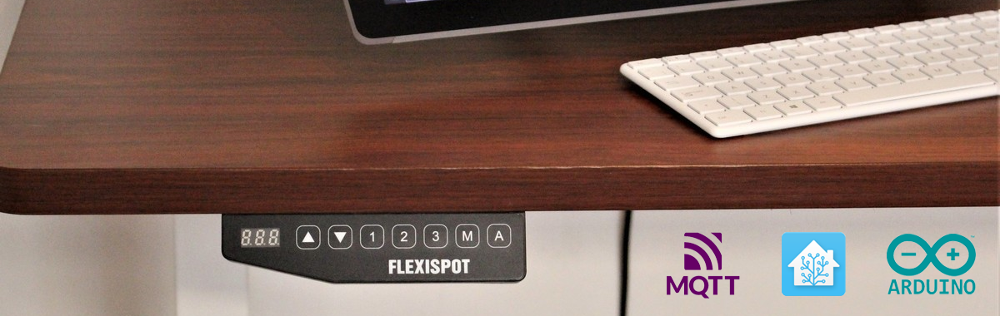
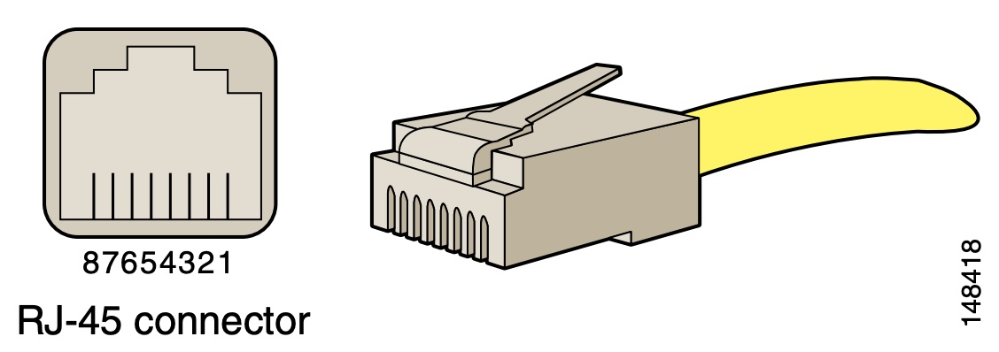

(*image source: [Windows Central](https://www.windowscentral.com/flexispot-e5-standing-desk-review)*)

## Turn your LoctekMotion/FlexiSpot desk into a smart desk

Recently I acquired a new standing desk from FlexiSpot. During assembly I noticed that the control panel had a RJ45 cable and a second RJ45 port, which sparked my interest. Can we connect my desk to the internet?

Most of the models Flexispot sells are using components from LoctekMotion. [LoctekMotion](https://www.loctekmotion.com/) is a manufacturer of lifting columns for height adjustable standing desks. On their website they mention a [bluetooth receiver](https://www.loctekmotion.com/shop/accessories/bt-desk-app/) that can be inserted to the control box, but I haven't been able to find this.

This repository will help you to connect your desk to the internet via the serial communication ports (RJ45), for example for use with [Home Assistant](https://www.home-assistant.io/). Think of scenarios like controlling your desk via voice or creating notifications when you sit for too long.
(or just because it is cool 🤓)

## Packages

> Use the information in this repository at your own risk and with caution. Tinkering with electronics always has risks.

| Name                                  | Description                                                                |
| ------------------------------------- | -------------------------------------------------------------------------- |
| [Arduino](packages/arduino)           | Custom code to control your desk via an ESP32/ESP8266 module via MQTT.     |
| [ESPHome](packages/esphome)           | Control your desk via an ESP32/ESP8266 module connected to Home Assistant. |
| [Raspberry Pi](packages/raspberry-pi) | Custom code to control your desk via a Raspberry Pi via Python.            |

For more packaged solutions, see [similar projects](#similar-projects--research). Pull requests are welcome.

## Research

If you are interested in the internals of the LoctecMotion desk system, have a look at the research below which is composed of my own findings combined with findings of [similar projects](#similar-projects--research).

### Control Panels

At the time of writing, LoctekMotion sells [11 different control panels](https://www.loctekmotion.com/product/control-panel/). The features can differ per model, but it looks like the serial interface is pretty similar for the more advanced models.

The tables below will show a mapping of the RJ45 pinout to the pinout used by the control panel. Please note that all RJ45 pins are described in the following way;

In order to connect the control box to a Raspberry Pi and ESP32/ESP8266 chip I used a [RJ45 to RS232 adapter](https://www.allekabels.nl/rs232-kabel/4568/1041186/rj45-naar-rs232.html) with DuPont cables (jump wires), but you simply can cut and split an ethernet cable as well.

#### Supported Control Panels
<!-- prettier-ignore-start -->
<!-- markdownlint-disable -->
<table>
  <tr>
    <td align="center"><a href="#hs13a-1"> <b>HS13A-1</b></a> </td>
    <td align="center"><a href="#hs01b-1"> <b>HS01B-1</b></a> </td>
  </tr>
</table>
<!-- markdownlint-enable -->
<!-- prettier-ignore-end -->

If your control panel is missing, feel free to [create an issue](https://github.com/iMicknl/LoctekMotion_IoT/issues/new) to discuss the possibilities or create a PR to add your research to this overview.  

#### [HS13A-1](https://www.loctekmotion.com/shop/control-panel/hs13a-1/)

- **Desk model**: Flexispot EK5
- **Tested with control box**: CB38M2B(IB)-1
- **Source**: Printed on the PCB of the control box.
  
| RJ45 pin | Name       | Original Cable Color | Ethernet cable color (T568B) |
| -------- | ---------- | -------------------- | ---------------------------- |
| 8        | RESET SWIM | Brown                | White-Orange                 |
| 7        | PIN 20     | White                | Orange                       |
| 6        | RX         | Purple               | White-Green                  |
| 5        | TX         | Red                  | Blue                         |
| 4        | GND1       | Green                | White-Blue                   |
| 3        | +5V (VDD)  | Black                | Green                        |
| 2        | 29V+       | Blue                 | White-Brown                  |
| 1        | 29V-       | Yellow               | Brown                        |

Note that RX and TX is defined like this on receiver (control panel) side. So RX can be used to receive data, TX to send data.

#### [HS01B-1](https://www.loctekmotion.com/shop/control-panel/hs05a-1/)

- **Desk model**: Flexispot E5B
- **Tested with control box**: CB38M2A-1
- **Source**: [nv1t/standing-desk-interceptor](https://github.com/nv1t/standing-desk-interceptor)
  
| RJ45 pin | Name      | Original Cable Color  | Ethernet cable color (T568B) |
| -------- | --------- | --------------------- | ---------------------------- |
| 8        | +5V (VDD) | Yellow                | Brown                        |
| 7        | GND       | Blue                  | White-Brown                  |
| 6        | TX        | Black                 | Green                        |
| 5        | RX        | Green                 | White-Blue                   |
| 4        | PIN 20    | Red                   | Blue                         |
| 3        | (unknown) | Purple                | White-Green                  |
| 2        | SWIM      | White                 | Orange                       |
| 1        | RES       | Brown                 | White-Orange                 |

Note that RX and TX is defined like this on receiver (control panel) side. So RX can be used to receive data, TX to send data.

Other control panels / control boxes could be supported in the same way, but you would need to figure the RJ45 pinout mapping. Most control boxes have an extra RJ45 port for serial communication, but otherwise you would need to place your device in between the control panel and the control box.

### Retrieve current height

Based upon the great work of [minifloat](https://www.mikrocontroller.net/topic/493524), it became clear that the control panel utilises a [7-segment display](https://en.wikipedia.org/wiki/Seven-segment_display). Fortunately, this is very common in such devices and thus there is a lot of [documentation](https://lastminuteengineers.com/seven-segment-arduino-tutorial/) on this topic. 

The control box sends the height as 4-bit hexadecimal, which is decoded in the control panel to drive the 7-segment display. The second number on the display also supports an optional decimal point ("8 segment").

Make sure you set the baud rate to 9600. For most LoctekMotion desks, the control box only broadcasts the current height for x seconds after you sent the Wake Up command. Otherwise you will receive `0x00` `0x00` `0x00` as payload.

source: [alselectro](https://alselectro.wordpress.com/2015/03/03/8051-tutorials-3-interfacing-7-segment-display/)

### Execute a command

The control box only accepts commands when the 'screen is active'. To activate the screen, `PIN 20` needs to be set to HIGH for about 1 second. The screen gets disabled automatically again after some amount of time receiving no commands.

#### Command list

| Command name      | Start | Length | Type | Payload   | Checksum  | End  |
| ----------------- | ----- | ------ | ---- | --------- | --------- | ---- |
| Wake Up           | `9b`  | `06`   | `02` | `00` `00` | `6c` `a1` | `9d` |
| Up                | `9b`  | `06`   | `02` | `01` `00` | `fc` `a0` | `9d` |
| Down              | `9b`  | `06`   | `02` | `02` `00` | `0c` `a0` | `9d` |
| M                 | `9b`  | `06`   | `02` | `20` `00` | `ac` `b8` | `9d` |
| Preset 1          | `9b`  | `06`   | `02` | `04` `00` | `ac` `a3` | `9d` |
| Preset 2          | `9b`  | `06`   | `02` | `08` `00` | `ac` `a6` | `9d` |
| Preset 3 (stand)  | `9b`  | `06`   | `02` | `10` `00` | `ac` `ac` | `9d` |
| Preset 4 (sit)    | `9b`  | `06`   | `02` | `00` `01` | `ac` `60` | `9d` |

All bytes combined will become the command to send to the control box. See the [packages](#packages) for sample code.

## Similar projects / research

While working on this project, I found out that I am not the only one with this idea. There are a few repositories on GitHub with great research which helped me kickstart this project. ❤️

- [grssmnn / ha-flexispot-standing-desk](https://github.com/grssmnn/ha-flexispot-standing-desk) - Home Assistant integration via MQTT (micropython)
- [Dude88 / loctek_IOT_box](https://github.com/Dude88/loctek_IOT_box) - Arduino code to control via Alexa and MQTT 
- [nv1t / standing-desk-interceptor](https://github.com/nv1t/standing-desk-interceptor) - Research on intercepting commands from Flexispot desks
- [VinzSpring / LoctekReverseengineering](https://github.com/VinzSpring/LoctekReverseengineering#assumptions) - Research and Python samples

and a huge thanks to the [Tweakers.net](https://gathering.tweakers.net) community (Dutch), whom helped me to kickstart this project.

## Support
Join our [Discord channel](https://discord.gg/C7TNzUZ9Xf)
